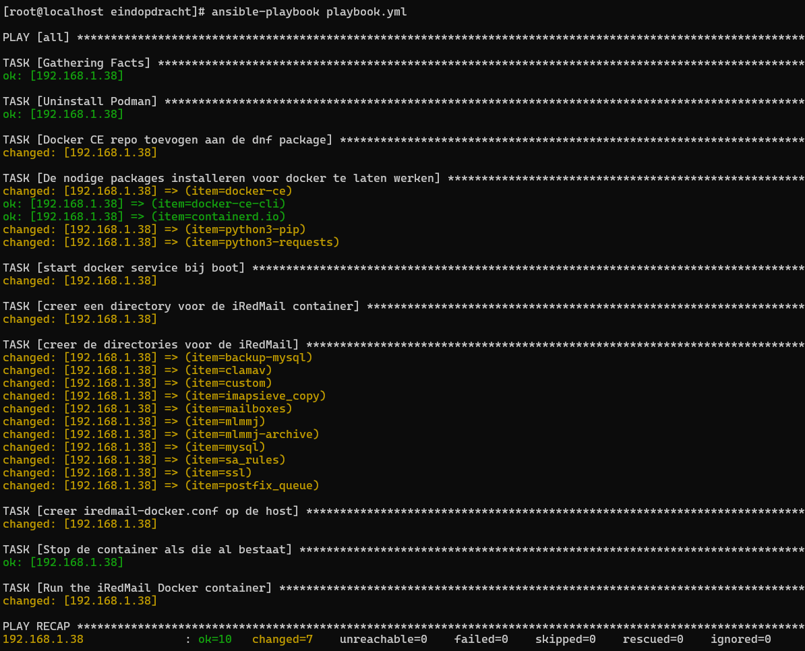

# vars.yml

(nederlands)

In het bestand vars.yml moet je het volgende configureren:

De locatie van de docker container
De hostnaam van je mailserver
Het maildomein
Het admin wachtwoord van de beheerconsole
Het bestand vars.yml zou er als volgt uit moeten zien:
    
    IREDMAIL_DIR: /opt/iRedMail
    HOSTNAME: mail.example.com
    FIRST_MAIL_DOMAIN: example.com
    FIRST_MAIL_DOMAIN_ADMIN_PASSWORD: testpassword

je voert de playbook uit met:

    ansible-playbook playbook.yml

Nadat het playbook is uitgevoerd, ga je naar:

    http://<ip-address>/iredadmin

Dit is het beheerpaneel van de iRedMail server. Hier kun je instellingen configureren, gebruikers toevoegen, enz. Je kunt inloggen met de inloggegevens die je hebt ingesteld in het vars.yml bestand.

    username: postmaster@example.com
    password: FIRST_MAIL_DOMAIN_ADMIN_PASSWORD

Om naar het mailpaneel te gaan om e-mails te verzenden en te ontvangen, ga je naar:

    http://<ip-address>

(english)

In the vars.yml file you have to configure:
1. The location of the docker container
2. The hostname of your mail server
3. The mail domain
4. The admin password of the the admin console

The vars.yml file should look like this:

    IREDMAIL_DIR: /opt/iRedMail
    HOSTNAME: mail.example.com
    FIRST_MAIL_DOMAIN: example.com
    FIRST_MAIL_DOMAIN_ADMIN_PASSWORD: testpassword

After the playbook has executed head to:

    http://<ip-address>/iredadmin

This is the admin panel of the iRedMail server, here you can configure settings, add users ect.
You can login with the credentials you set in the vars file
    
    username: postmaster@example.com
    password: FIRST_MAIL_DOMAIN_ADMIN_PASSWORD

To head to the mail panel to send an recieve mails head to:

    http://<ip-address>

